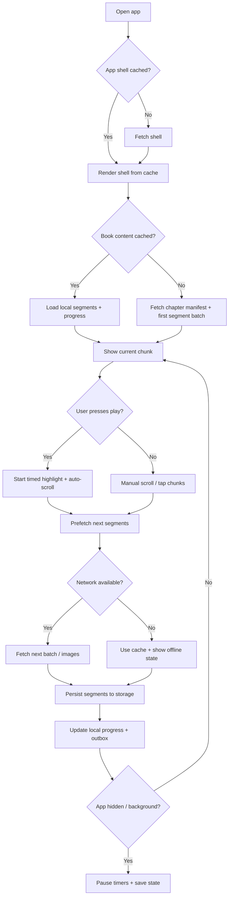
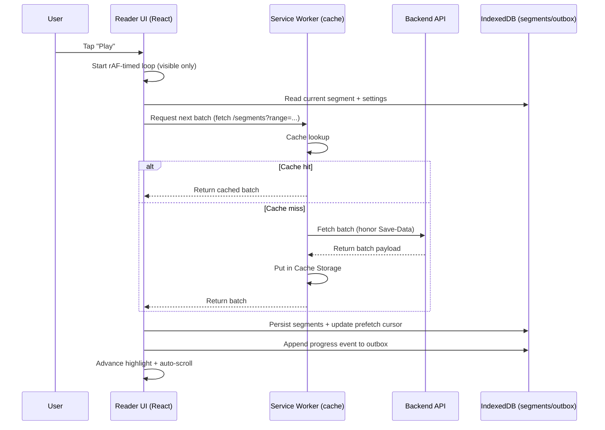
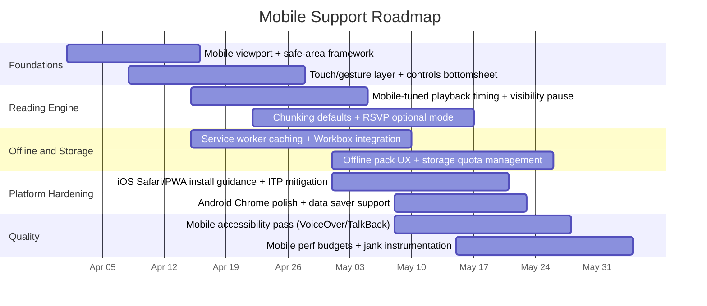

# Mobile-First PRD Update for a React Speed-Reading Ebook Web App

## Executive summary

This PRD update extends an existing React-based speed‑reading ebook web app PRD to explicitly support seamless mobile operation across iOS and Android browsers, with installable PWA behavior as the primary delivery channel and optional native packaging as a secondary path. The core product loop remains: ingest an ebook → extract structured content → chunk into highlightable “speed‑reading sections” → play with timed highlighting and auto‑scroll → stream/load more content just‑in‑time as the user progresses. The update focuses on the mobile realities that most often break reading experiences: dynamic viewports (address bar / keyboard), safe-area insets on notched devices, touch-first interaction, intermittent cellular networks, low memory and CPU throttling, and platform-specific background execution/storage constraints.

Key decisions and constraints that drive the mobile design:

- **PWA-first, install‑encouraged for iOS reliability.** iOS install flows differ from Android; iOS does not support the `beforeinstallprompt` event, and installation is driven via the Share menu (with broader browser support on iOS 16.4+). citeturn3view0  
- **Offline-first is feasible but must account for Safari data eviction behavior.** WebKit’s Intelligent Tracking Prevention (ITP) can delete “script‑writable storage” (including IndexedDB and service worker registrations/caches) after 7 days without user interaction; however, the *first-party domain of home screen web apps is exempt* and isolated from Safari’s ITP removal algorithm. citeturn4search1turn4search0  
- **Do not rely on “background tasks” on mobile.** Service workers can be terminated when idle; background sync and long-running background fetch/periodic sync are “limited availability”/experimental and not broadly supported across widely used browsers. citeturn4search7turn2view2turn9view0turn9view1  
- **Default chunking should not be pure word-by-word RSVP.** Multiple studies report comprehension and fatigue drawbacks for Spritz-like RSVP at higher speeds; the product should support RSVP modes but recommend phrase/sentence-based chunking as the primary default. citeturn17search0turn17search7  
- **Performance targets should be measured with mobile-centric metrics and instrumentation.** Adopt field-measured Web Vitals thresholds (LCP ≤ 2.5s; INP ≤ 200ms at p75) and detect main-thread “long tasks” (>50ms) to manage jank during continuous reading. citeturn15search1turn15search2turn7search3turn7search7  

Success for this mobile update is defined by: fast time-to-first-chunk on cellular networks; smooth, jank-free highlighting/scrolling; robust progress persistence and offline continuity; touch-first ergonomics; and strong accessibility for mobile screen readers (VoiceOver/TalkBack) and adjustable pacing.

## Mobile-first product requirements and UX

Mobile support is not only “responsive layout.” It requires treating the device as the primary interaction surface: thumb reach, dynamic browser chrome, a virtual keyboard that changes the visual viewport, and OS-level gestures that can conflict with app gestures.

### Product goals and non-goals for mobile

Mobile goals:
- “Open and read immediately,” including for large books over cellular networks.
- Continuous play experience with minimal UI friction (single-handed use).
- Reliable progress tracking across tab suspensions, app switching, and low-memory evictions.
- Offline and spotty-network resilience for the current chapter and near-future content.

Mobile non-goals (for first mobile milestone):
- Heavy, background-only synchronization guarantees (not reliable across platforms). citeturn2view2turn9view0turn9view1  
- Guaranteed long-lived local storage for non-installed Safari usage (must be mitigated with install guidance and server-side sync). citeturn4search1  

### Mobile UI layout requirements

Responsive layout requirements:
- Support phone portrait first; add optimized tablet portrait/landscape layouts; support split-screen/multi-window by responding to viewport changes rather than assuming fixed dimensions.
- Use dynamic viewport units (`dvh`, `dvw`) to mitigate mobile browser UI expansion/retraction (e.g., collapsing address bar), instead of relying only on classic `vh` (“large viewport”). citeturn13search2  
- Use safe-area insets via CSS environment variables (`safe-area-inset-*`) and enable edge-to-edge layouts via `viewport-fit=cover` where appropriate for notched displays. citeturn6search15turn1search6  
- When the on-screen keyboard appears, position controls relative to the **visual viewport** (not just the layout viewport) using the `VisualViewport` API as a primary approach; this is explicitly motivated by mobile keyboard behavior. citeturn1search3turn1search7  
- Treat the `VirtualKeyboard` API as an opportunistic enhancement (experimental and not uniformly supported); build core behavior without it. citeturn1search23  

### Touch-first controls and gestures

Core mobile reading controls must be usable with one hand and accessible (screen readers, switch control). Touch targets should meet platform guidance:
- iOS guideline: minimum 44×44 points. citeturn11search2turn11search6  
- Android guidance: consider at least 48×48 dp (≈9mm physical). citeturn11search1  

Gesture model (default):
- Tap center: play/pause.
- Swipe up/down: adjust WPM (coarse).
- Horizontal swipe: jump back/forward by N chunks (configurable).
- Long press: open contextual actions (bookmark, highlight mode, “save offline,” copy quote if permitted).

Implementation notes (mobile correctness):
- Use Pointer Events (single unified model for mouse/pen/touch) instead of maintaining divergent TouchEvents and MouseEvents handlers where possible. Pointer Events are standardized by entity["organization","World Wide Web Consortium","standards body"] and documented as a unified input model. citeturn10search0turn10search1  
- Declare gesture intent via `touch-action` so the browser can optimize and so custom gestures don’t accidentally trigger default scrolling/zooming behavior. citeturn6search1  
- Avoid accidental pull-to-refresh or back/forward swipe navigations in “full-screen reader” mode by using `overscroll-behavior: contain` or an equivalent strategy on the primary scroll container. citeturn6search29  
- Use passive event listeners for touch/wheel gestures when you never call `preventDefault`, to prevent scroll performance degradation. citeturn6search10turn6search2  

Haptics:
- On Android Chrome where supported, optional haptic feedback can be delivered via the Vibration API as a mild confirmation (e.g., pause/play toggle). The API is a no-op when unsupported. citeturn5search2  
- Safari (including iOS Safari) has historically not supported `navigator.vibrate`; treat haptics as Android-only unless a platform-supported method emerges. citeturn5search37turn5search6  

### Mobile keyboard and IME handling

Mobile has multiple “keyboard” modalities:
- Software keyboard (most common)
- Hardware keyboard (tablets or Bluetooth)
- IME composition (e.g., Chinese/Japanese input)

Requirements:
- Search, notes, and metadata entry must be robust with IME composition events. Composition events are standardized and explicitly model IME workflows; do not treat composition as “keydown sequences.” citeturn8search7turn8search27  
- When a text field is focused, reader auto-scroll/highlight should pause, and controls should reflow above the keyboard using `VisualViewport` resize events. citeturn1search7turn1search3  

### Auto-scroll and highlighting UX on mobile

Mobile constraints:
- Timers and animation callbacks can be throttled when pages are hidden/backgrounded to save battery; do not assume `setInterval` remains accurate. citeturn8search0  
- Safari/WebKit service worker timers can be throttled extremely aggressively in some cases; avoid architecting the reading engine around background service worker timers. citeturn8search14  

UX requirements:
- Playback timing model must be resilient: drive animation via `requestAnimationFrame` when visible; pause on `visibilitychange`; resynchronize on resume. citeturn8search0turn8search32  
- Provide pacing controls: WPM slider; “pause on punctuation” (configurable); “rewind 1–3 chunks” quick action; and a “focus mode” that minimizes UI chrome.

Optional “focus/eye-tracking”:
- Not in scope for baseline mobile web due to sensor constraints and privacy surface; can be explored separately for native wrappers.

### Mobile accessibility requirements

Mobile accessibility must be tested with the platform’s dominant screen readers:
- VoiceOver evaluation criteria emphasize that all visible text and controls should be operable and spoken; navigation and grouping should be logical and consistent. citeturn10search3  
- Android accessibility guidance emphasizes labeling elements and operability with accessibility services such as TalkBack. citeturn11search0turn11search11  

Acceptance-level accessibility requirements:
- Minimum tap target sizes follow platform guidance (44pt iOS; 48dp Android). citeturn11search2turn11search1  
- Reader controls are reachable and operable via screen reader rotor/gesture navigation; focus order remains logical after orientation changes and layout reflow. citeturn11search21turn10search3  
- Auto-advancing highlights do not trap focus; screen reader users can pause and step through chunks manually.

### Mobile feature list

| Feature area | Mobile-specific requirements | Notes / rationale |
|---|---|---|
| Installable experience | iOS install flow via Share menu; provide in-app “How to install” affordance; do not depend on `beforeinstallprompt` on iOS | iOS does not support `beforeinstallprompt`; iOS 16.4+ supports install from multiple browsers via Share menu citeturn3view0 |
| Safe areas & viewport | Use `env(safe-area-inset-*)`, `viewport-fit=cover`, dynamic viewport units (`dvh`), and `VisualViewport` handling | WebKit guidance on safe areas; MDN environment vars; dynamic viewport units stabilize layout citeturn6search15turn1search6turn13search2turn1search3 |
| Touch gestures | Pointer Events + `touch-action`; avoid gesture conflicts with overscroll/back swipe | Pointer Events unify input; `touch-action` declares gesture intent citeturn10search1turn6search1turn6search29 |
| Offline-first reading | Service worker caching; explicit “save offline” per book/chapter; do not count on background fetch | Cache API supports offline; background fetch is limited availability citeturn9view2turn9view0 |
| Storage persistence | Attempt `navigator.storage.persist()`, show storage usage, and encourage install on iOS Safari due to ITP eviction | Persistent storage is requestable; Safari ITP 7‑day cap affects non-installed sites; home screen apps exempt citeturn9view4turn4search1turn4search0 |
| Bandwidth savings | Honor `Save-Data`; reduce image quality and prefetch intensity | `Save-Data` indicates user preference for reduced data usage citeturn7search0 |
| Battery/CPU | Pause on hidden; chunk processing in workers/idle time | Background throttling is common; requestIdleCallback is explicitly for low priority work citeturn8search0turn15search4 |

### Mobile user stories and acceptance criteria

| User story | Acceptance criteria (mobile explicit) |
|---|---|
| As a phone user, I can start reading within seconds on cellular | On a cold load (no cache), the app shell renders and the first readable chunk is shown within the app’s mobile performance budget; LCP and INP targets are met at p75. citeturn15search1turn15search2 |
| As a user, I can control speed with one hand | Tap and swipe gestures work reliably without triggering pull-to-refresh or browser navigation; touch targets meet platform tap-size guidance. citeturn6search29turn11search2turn11search1 |
| As a user, I can rotate my device without losing my place | On orientation change, the reader maintains current chunk index; UI respects safe areas and dynamic viewport changes. citeturn6search15turn13search2 |
| As a user, I can continue reading with spotty connection | Next segments are prefetched opportunistically; if offline, cached segments load (cache-first/stale-while-revalidate strategy) and progress is stored locally until sync is possible. citeturn9view2turn2view3 |
| As an iOS Safari user, I don’t lose my downloaded content unexpectedly | The app communicates Safari’s storage eviction behavior and recommends installation; installed web app behavior isolates and exempts the domain from ITP’s 7‑day cap. citeturn4search1turn3view0 |
| As a VoiceOver/TalkBack user, I can operate playback and navigation | Controls have accessible names/roles; focus order is logical; play/pause and step navigation are operable using screen reader gestures and actions. citeturn10search3turn11search0 |

### Mobile reading flowchart

This loop is designed around platform realities: caching via service worker/Cache API, and visibility-driven pause/resume because background tab throttling is expected. citeturn9view2turn8search0  

## Content formats and chunking for mobile speed-reading

### Supported ebook formats

The product should treat ebook formats as an extensible “ingestion layer” with a canonical internal representation. Initial explicit targets:

- **EPUB**: prioritize because it is web-native (HTML/CSS resources in a container) and standardized by entity["organization","World Wide Web Consortium","standards body"]. EPUB publications include a package document with metadata, a manifest of resources, and a spine defining default reading order. citeturn16search0  
- **PDF**: support as fixed-layout content; PDF 2.0 is standardized as ISO 32000-2 and is designed for environment-independent document rendering. citeturn16search1turn16search17  
- **MOBI / “Mobipocket”**: support as an ingestion format primarily via conversion to internal HTML-ish representation; MOBI files may contain combination content (e.g., KF7/KF8 segments) depending on the file. citeturn16search2  

DRM (optional):
- If DRM must be supported, treat it as a separate “protection profile,” not a format. Readium LCP is a vendor-neutral DRM solution with published specifications and ecosystem tooling managed by entity["organization","EDRLab","digital publishing org"]. citeturn16search7turn16search11  

### Canonical internal representation

Normalize all formats into a “Publication Model”:

- Publication → Chapters (reading order) → Blocks (paragraphs/headings/lists/figures) → Runs (text spans with styles) → Segments (speed-reading chunks)
- Segments become the timed playback unit, with stable IDs and offsets back to the underlying chapter text to support highlighting and progress synchronization.

This mirrors the intent of EPUB’s spine/manifest separation—reading order vs resources—while enabling uniform treatment across formats. citeturn16search0  

### Chunking algorithms and mobile-specific considerations

Mobile chunking must balance:
- comprehension,
- viewport size,
- “glanceability” (short attention windows),
- and CPU/battery constraints.

Chunking modes (all supported; defaults tuned for mobile):

- Word-based RSVP mode (Spritz-like). Research on Spritz/RSVP indicates possible comprehension impairment and increased visual fatigue at higher speeds, so RSVP should be an opt-in mode and not the mobile default. citeturn17search0turn17search7  
- Phrase-based chunking (recommended default). A common definition of chunking is grouping words into short meaningful phrases, often ~3–5 words. citeturn17search36  
- Sentence/clause-based chunking. Use punctuation and syntactic boundaries to reduce cognitive load; psycholinguistic work often treats chunk boundaries as meaningful units of processing, with observed transitions at sentence/chunk boundaries. citeturn17search5  
- Context-aware NLP chunking. Use a two-stage approach (coarse segmentation + refinement) inspired by modern NLP text segmentation research; run heavy processing server-side where possible, and use client-side fallback for small passages. citeturn17search32  

Mobile implementation guidance:
- Prefer chunking that does **not** require high-frequency DOM measurement during playback; compute segment timing primarily from textual features (word counts, punctuation weight) rather than pixel-perfect line metrics, because font rendering and measurement can vary across engines and platforms. citeturn13search1turn13search28  
- When pixel measurement is needed (e.g., to ensure chunks fit within a “focus window”), wait for fonts to load using the CSS Font Loading API (`document.fonts.ready`) before finalizing chunk layout. citeturn13search4turn13search28  

Timing model for adjustable WPM:
- Segment duration = base words / WPM + punctuation pauses (comma/semicolon/period scaling) + “complexity penalty” (long words, numerals, uncommon tokens).  
- Provide a per-language tokenization strategy; for CJK languages, segments should be character- or phrase-based rather than whitespace-token-based.

### Handling images, tables, and non-text elements on mobile

Constraints:
- PDFs often embed text as positioned glyphs; tables can be difficult to reconstruct reliably. EPUB may include images, SVG, or fixed-layout pages. citeturn16search0turn16search1  

Requirements:
- Treat figures/tables as first-class “atomic blocks” in the canonical model with display constraints:
  - show as an interstitial “figure card” in playback,
  - allow pinch-to-zoom and pan,
  - require explicit tap to advance or “auto-advance after N seconds” with preview.
- For bandwidth: compress images and serve responsive sizes; when `Save-Data: on` is present, prefer smaller assets and reduce prefetching. citeturn7search0  

## Client architecture and streaming strategy for mobile performance

### Mobile performance and reliability constraints

Mobile browsers commonly:
- throttle timers in background tabs and stop `requestAnimationFrame` in hidden tabs. citeturn8search0  
- can freeze/discard pages under memory pressure (Chrome’s lifecycle model explicitly documents “frozen” and “discarded” states). citeturn8search1  
- terminate service workers when idle; in-memory state should not be assumed persistent across SW restarts. citeturn4search7turn4search10  

iOS Safari / WebKit constraints that must be explicitly addressed:
- ITP can remove script-writable storage after 7 days without user interaction; includes IndexedDB and service worker registrations/caches. Home screen web apps are exempt and isolated from Safari’s ITP classification/removal. citeturn4search1turn4search0  
- Service worker timers may be throttled aggressively in some conditions; this reinforces “foreground-driven playback” architecture. citeturn8search14  

### Streaming/loading strategy for smooth reading

Design principle: **stream segments, not full chapters**, and keep an in-memory working set sized to a mobile budget.

Segment delivery:
- Client requests “segment batches” keyed by (bookId, chapterId, segmentIndexRange).  
- Server returns a compact payload (optionally compressed at transport layer) plus metadata for highlight mapping.

Prefetch:
- Prefetch N segments ahead based on reading speed and network quality hints (where supported). The Network Information API provides signals like `effectiveType` and RTT/downlink estimates; use as a best-effort input, not a hard dependency. citeturn7search9turn7search1turn7search5  
- Respect `Save-Data` to reduce prefetch aggressiveness and choose lighter assets. citeturn7search0  

Offline storage and eviction strategy:
- Store segments in IndexedDB (structured) and optionally store larger binary resources in Cache Storage (Request/Response pairs) through a service worker. citeturn9view3turn9view2  
- Periodically check storage usage/quota and degrade prefetching; `navigator.storage.estimate()` provides usage/quota signals. citeturn4search6turn4search2  
- Request persistent storage where supported (`navigator.storage.persist()`), understanding that browsers may honor or reject it depending on rules. citeturn9view4  
  - Inference (design implication): This helps against “storage pressure eviction,” but does not replace Safari ITP’s explicit 7‑day removal policy; therefore, iOS must still prioritize install guidance and server-side progress sync. citeturn4search1turn9view4  

### Service worker, caching, and offline-first architecture on mobile

Use a service worker primarily for:
- app-shell precaching,
- runtime caching of segment batches and images,
- offline fallback routing.

MDN describes service workers as enabling offline-first experiences by intercepting fetches and serving from cache where appropriate. citeturn2view3turn14search8  

Caching strategies:
- App shell: precache (Workbox `workbox-precaching`) and versioned updates. citeturn5search1turn5search13  
- Segment batches: stale-while-revalidate or cache-first with refresh depending on freshness requirements. citeturn9view2  
- Images: cache-first with cache size limits; downgrade quality when `Save-Data` is present. citeturn7search0  

Implementation tooling:
- Workbox is a practical choice to reduce service worker boilerplate and implement precaching/runtime caching patterns. citeturn5search1turn5search9  

### React architecture for mobile

Rendering model:
- Heavy parsing/chunking runs in Web Workers (client) or backend jobs (preferred).  
- UI uses a small reactive state core:
  - Reader state: current segment, playback state, WPM, mode, viewport info, offline status.
  - Storage state: cache inventory, quota, outbox unsent events.

SSR/CSR tradeoffs:
- SSR can reduce perceived first render by shipping HTML that React hydrates (via `hydrateRoot`) rather than waiting for full client rendering. citeturn12search0turn12search4  
- Mobile-first baseline can be CSR + aggressive app-shell caching; SSR can be added later if initial render metrics demand it.

Virtualization:
- Virtualize the “scrolling transcript” and optionally the “chapter outline” to reduce DOM size and memory on mobile.
- `react-window` and `react-virtualized` are established libraries for rendering large lists efficiently; `react-window` positions itself as focused on performance and minimal overhead. citeturn12search1turn12search9  

Comparative table: virtualization libraries (mobile relevant)

| Library | Strengths | Risks/limitations | Recommended use |
|---|---|---|---|
| react-window | Lightweight, performance-focused “windowing” for large lists. citeturn12search1 | More DIY for complex layouts | Primary virtualization choice for transcript + chapter lists |
| react-virtualized | Feature-rich for lists/grids/tables. citeturn12search9 | Larger surface area; more complexity for mobile tuning | Use if advanced grid/table virtualization becomes required (e.g., PDF tables) |

Component hierarchy updates (mobile explicit)
- `AppShell`
  - `InstallNudgeBanner` (iOS instructions; Android install prompt surface)
  - `LibraryView` (upload/import, recently opened)
  - `ReaderRoute`
    - `ReaderViewport` (safe area + dvh layout; owns `VisualViewport` syncing)
      - `TranscriptPane` (virtualized)
      - `FocusChunkOverlay` (highlight box; timed transitions)
      - `ControlsBottomSheet` (thumb-zone controls; safe-area padding)
      - `GestureLayer` (pointer events + touch-action)
    - `OfflineStatusToast`
    - `A11yAnnouncer` (ARIA live region; screen reader hints)

Mobile viewport correctness:
- Prefer layout that uses `dvh` rather than legacy `vh`, and safe-area insets for padding. citeturn13search2turn1search6  

### Sequencing diagram for “play” with streaming prefetch

This explicitly uses “foreground playback + cache-mediated fetch,” rather than background-only mechanisms (Background Fetch / Periodic Sync), which have limited availability. citeturn9view0turn9view1turn7search0  

### Mobile-friendly delivery approaches and prioritized tech choices

The app should prioritize web-native delivery first, then consider native packaging to close platform gaps.

| Approach | Pros | Cons | Priority recommendation |
|---|---|---|---|
| PWA (installable) | Fast iteration, single codebase. Installability defined via manifest/HTTPS; offline via service worker/caches. citeturn2view4turn2view3 | iOS install UX differs; iOS `beforeinstallprompt` not supported; background capabilities uneven. citeturn3view0turn9view0 | Highest priority baseline |
| PWA + Workbox | Standardized precaching/runtime caching patterns; reduces SW complexity. citeturn5search1turn5search9 | Requires careful cache versioning and update UX | High priority |
| Capacitor wrapper | Cross-platform native runtime for web apps; supports web+native with shared APIs; offers native plugins and storage approaches. citeturn12search21turn12search14turn12search2 | Adds native build/release pipeline; WebView differences and app-store review constraints | Medium priority “phase two” to mitigate iOS gaps if needed |
| React Native for Web | Compatibility layer between React DOM and React Native; can share UI abstractions. citeturn12search3turn12search19 | Still ultimately runs in browser on mobile; doesn’t inherently solve iOS Safari constraints | Low priority unless team is already RN-centric |
| Full React Native app | Best access to native features and background scheduling | Two codepaths or more complex architecture; re-implement reader rendering and parsing | Only if web delivery proves insufficient |

## Backend, APIs, and data models

### Backend responsibilities

Core backend services:
- File upload/import and validation.
- Conversion pipeline into canonical chapter text/blocks (EPUB package/spine parsing; PDF extraction; MOBI conversion). citeturn16search0turn16search1turn16search2  
- Segment generation (chunking modes), including NLP-heavy segmentation performed offline (batch job) to reduce mobile CPU use.  
- Segment batch API for low-latency streaming to clients.
- Progress/event ingestion and cross-device synchronization.
- Optional DRM/license integration (Readium LCP). citeturn16search7turn16search15  

### Data models impacted by mobile requirements

Core entities (logical schema):

| Model | Key fields | Mobile-driven changes |
|---|---|---|
| Device | `deviceId`, `platform` (ios/android/desktop), `installState` (installed/browser), `lastSeenAt` | Allows mobile-specific analytics and install nudges; supports iOS storage risk handling |
| OfflinePack | `bookId`, `scope` (chapter range), `status`, `bytesStored`, `createdAt`, `lastVerifiedAt` | Explicit representation of offline intent; enables UI + cleanup policies |
| OutboxEvent | `eventId`, `type` (progress/bookmark/highlight), `payload`, `createdAt`, `syncedAt` | Required because background sync is not reliable; flush when active/online citeturn2view2turn8search0 |
| SegmentBatch | `bookId`, `chapterId`, `startIdx`, `endIdx`, `segments[]` | Supports incremental fetching/virtualization and low-memory behavior |

Storage policy hooks:
- Record user interaction timestamps to better predict Safari’s “7-day without interaction” risk and to inform proactive “open the app to keep offline content” nudges. citeturn4search1turn4search0  

### API endpoints

Representative REST endpoints (versioned):

| Endpoint | Method | Purpose | Notes |
|---|---:|---|---|
| `/v1/publications/upload` | POST | Upload ebook file | Validate size/type; enqueue conversion |
| `/v1/publications/{id}` | GET | Publication metadata, chapters | Includes format type; conversion status |
| `/v1/publications/{id}/chapters/{chapterId}/segments` | GET | Fetch segment batch by range | Supports `rangeStart`, `rangeEnd`, optional compression |
| `/v1/publications/{id}/offline-pack` | POST | Create offline pack request | Server returns manifest of required resources; client downloads in foreground |
| `/v1/progress` | POST | Append progress events | Idempotent event IDs; supports outbox replay |
| `/v1/highlights` | POST/GET | Store/retrieve highlights | Respect copyright policies |
| `/v1/sync` | POST | Bulk sync (outbox flush) | Foreground-triggered; fallback when Background Sync unavailable citeturn2view2 |
| `/v1/realtime` | WS | Optional real-time multi-device sync | Use when active; do not rely for offline |

Headers and negotiation:
- Respect `Save-Data: on` to reduce payload sizes and prefetch-eligible responses. citeturn7search0  
- Optionally use Client Hints pragmatically (with privacy considerations); client hints exist for device/network negotiation. citeturn7search4turn7search28  

Offline “download in foreground” design:
- Avoid depending on Background Fetch for large offline downloads because it is experimental and limited availability. citeturn9view0  
- Provide resumable downloads via repeated segment-batch requests, storing partial completion state in IndexedDB.

## Security, privacy, DRM, and compliance

### DRM and copyright posture

Because the app processes ebooks, copyright risk is inherent. The PRD should define a clear policy boundary:

- If the product is intended for personal user uploads: store only user-provided content; implement takedown and retention policies.
- If the product must support protected commercial/library ebooks: integrate Readium LCP as the DRM mechanism, following its published specifications and server/tooling ecosystem managed by entity["organization","EDRLab","digital publishing org"] (and promoted by the Readium community). citeturn16search7turn16search15turn17search21  

Mobile implications of DRM:
- License acquisition flows must be robust to intermittent connectivity (foreground retry) and storage volatility (install guidance on iOS Safari). citeturn4search1turn3view0  

### Privacy and data minimization on mobile

Mobile users are acutely sensitive to tracking and data usage.

Requirements:
- Minimize persistent identifiers; prefer rotating device IDs and server-side session tokens; separate analytics from content data.
- Provide a “data saver” mode that maps to reduced prefetch and smaller images, aligned with the `Save-Data` header semantics (explicit user opt-in into reduced data usage). citeturn7search0  
- Provide explicit offline storage controls and a “clear downloaded content” action to respect user expectations for storage reclamation.

### Secure contexts and service worker requirements

- Many modern web capabilities used here (service workers, background APIs, persistent storage requests) require HTTPS/secure contexts; installability also requires HTTPS/localhost. citeturn2view4turn2view2  

## Testing, analytics, deployment, and roadmap

### Testing strategy for mobile correctness

Device/browser matrix:
- iOS Safari (and iOS installed web app)
- Android Chrome
- Tablet form factors (iPadOS; Android tablets)
- Low-memory scenarios (simulate via Chrome Page Lifecycle discards where possible and real-device testing). citeturn8search1  

Debugging workflows:
- iOS: enable remote inspection via Web Inspector on device and the Develop menu in Safari on macOS. citeturn14search2turn14search20  
- Android: remote debug via `chrome://inspect#devices` in Chrome DevTools. citeturn14search1  

Automated testing layers:
- Unit tests: chunking logic, timing calculations, storage eviction handling.
- Integration tests: segment fetch + caching behavior, offline transitions, outbox replay.
- E2E tests: core reading flows; note that iOS Safari E2E automation is more constrained than Chromium; plan for real-device smoke tests in CI for key releases.

Accessibility testing:
- Manual runs with VoiceOver and TalkBack; ensure control labeling and logical navigation order, aligned with Apple and Android guidance. citeturn10search3turn11search0turn11search7  

### Analytics and metrics

Primary product metrics:
- Reading completion rate by book/chapter.
- Average sustained WPM and mode distribution (phrase vs RSVP).
- Retry/resume rate after interruptions.
- Offline usage: % sessions with offline packs; offline read minutes.

Mobile performance metrics (hard targets + measurement):
- Web Vitals: LCP ≤ 2.5s, INP ≤ 200ms at 75th percentile (segmented by mobile vs desktop). citeturn15search1turn15search2  
- Jank: detect main-thread long tasks (>50ms) during playback; long tasks are explicitly defined as >50ms and can be observed via Long Tasks API (where available). citeturn7search3turn7search7  
- “Time-to-first-chunk” (TTFC): custom metric from navigation start to first render of a readable segment; split by (cached vs network).

Battery/CPU instrumentation:
- Pause playback when hidden; timers throttling is expected in inactive tabs; track “hidden time during playback” and auto-recovery success. citeturn8search0turn8search32  
- Schedule heavy work in idle periods (`requestIdleCallback`) and break up long tasks (optionally via scheduling APIs like `scheduler.yield` where supported) to improve responsiveness. citeturn15search4turn15search20turn15search37  

### Deployment and scaling

PWA deployment model:
- CDN-hosted app shell with aggressive caching; service worker precaches the shell and runtime-caches segments.
- Adopt an “application shell” style architecture to minimize cold-start work, consistent with PWA architecture guidance. citeturn5search0turn5search4  
- Backend scales primarily on conversion jobs (CPU) and segment delivery (bandwidth). Use caching at the edge for public-domain books; for private uploads, segment caching is per-user/auth scoped.

Critical iOS nuance:
- Because Safari can clear script-writable storage after 7 days without interaction, PWA installation is not just a UX enhancement; it materially affects offline reliability. citeturn4search1turn3view0  

### Implementation roadmap with mobile milestones

Effort estimates are rough **person-weeks** for an experienced small team, assuming existing baseline PRD implementation exists and this is a mobile-focused update cycle.

Milestones and deliverables:

- Mobile reader MVP (≈6–8 person-weeks): responsive reader viewport using `dvh` + safe-area insets; touch-first controls; pause/resume on visibility; basic segment streaming. citeturn13search2turn1search6turn8search0  
- Offline-first v1 (≈6–10 person-weeks): Workbox-based app shell caching + runtime caching; offline pack download in foreground; quota monitoring and cleanup. citeturn5search1turn9view2turn4search2  
- iOS hardening (≈3–6 person-weeks): install nudges and documented flow; explicit handling of ITP 7-day eviction risk; storage persistence request; resilience to Safari quirks. citeturn4search1turn9view4turn3view0  
- Accessibility and performance gate (≈4–8 person-weeks): VoiceOver/TalkBack operability, target sizes, focus order; Web Vitals tracking; long task detection and remediation. citeturn10search3turn11search1turn15search1turn7search3  

This roadmap is explicitly shaped by mobile platform constraints: iOS install differences, Safari storage eviction policy, and limited availability of background download/sync APIs. citeturn3view0turn4search1turn9view0turn9view1